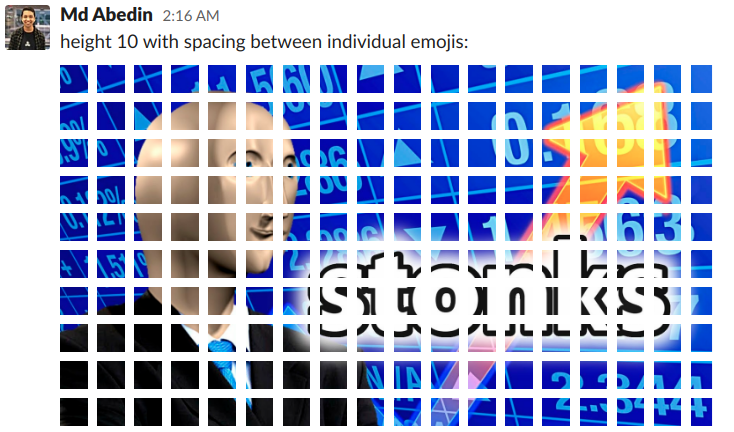

# slack-emoji-enlarger

A command-line tool to split an image or gif into tiles and upload each as a slack emoji to create the illusion of an enlarged slack emoji

## Dependencies

- [Python3](https://www.python.org/downloads/)
- If you're using images, [ImageMagick](https://imagemagick.org/script/download.php)
- If you're using gifs, [gifsicle](https://www.lcdf.org/gifsicle/)

## Usage
`slack-emoji-enlarger.py [-h] file_path size_dimension size emoji_base_name slack_subdomain slack_user_token`

Required arguments:
- `file_path`: path to image or gif to enlarge and upload
- `size_dimension`: which dimension the enlarged size will be given in, either `width` or `height`
- `size`: number of 128x128 emoji tiles either per column (height) or row (width) in final output
- `emoji_base_name`: base name of emojis to be uploaded. all emoji names will be of the form `:{emoji_base_name}-{X}:` where `X` is the index of the emoji within the grid from left to right, top to bottom, with leading zeros so that all corresponding emoji names are the same width
- `slack_subdomain`: the subdomain of the slack workspace where you want to upload the emojis: {`slack-subdomain`}.slack.com
- `slack_user_token`:  a slack user token from the slack-subdomain. usually starts with "xox"

Optional arguments:
- `-h, --help`: show help message and exit

## Notes
